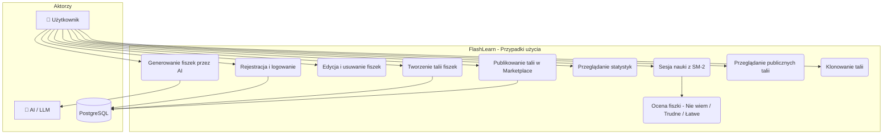
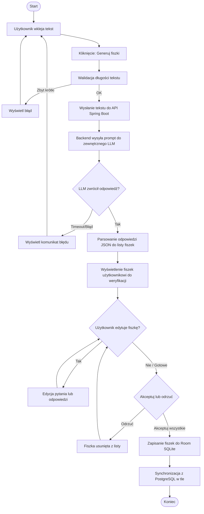
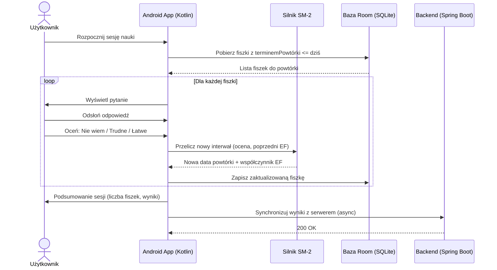
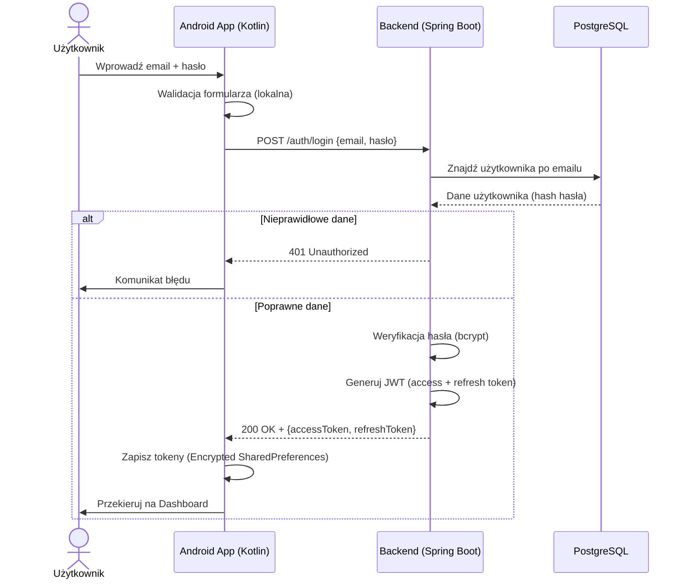

# FlashLearn

FlashLearn to innowacyjna aplikacja mobilna do nauki, która rozwiązuje problem nieefektywnego zapamiętywania poprzez wykorzystanie krzywej zapominania Ebbinghausa. System automatyzuje proces tworzenia materiałów dzięki AI oraz optymalizuje powtórki za pomocą algorytmu spaced repetition.

## Wizja projektu

Tradycyjne metody nauki są pasywne i nieefektywne, co sprawia, że człowiek zapomina większość nowego materiału w ciągu doby. FlashLearn rozwiązuje ten problem, automatyzując tworzenie fiszek przy pomocy AI i optymalizując proces powtórek algorytmem spaced repetition. Projekt ma na celu wyeliminowanie braków istniejących rozwiązań, takich jak przestarzałe interfejsy, brak synchronizacji czy konieczność ręcznego tworzenia materiałów.

## Opis MVP

- **Generowanie fiszek przez AI**: Automatyczne tworzenie par pytanie/odpowiedź z surowego tekstu z opcją weryfikacji i edycji przed zapisaniem.
- **Algorytm SM-2**: Personalizacja sesji nauki na podstawie ocen trudności (Nie wiem / Trudne / Łatwe) wystawianych przez użytkownika.
- **Synchronizacja i Marketplace**: Bezpieczne zarządzanie kontami (JWT), synchronizacja z bazą PostgreSQL oraz platforma do wymiany publicznych talii.
- **Tryb Offline-First**: Możliwość nauki i tworzenia treści bez dostępu do sieci dzięki lokalnej bazie Room, z synchronizacją w tle.

## Zespół

- **Jakub Siłka** – [@jakub7038](https://github.com/jakub7038)
- **Paweł Powęska** – [@SpeedYoo](https://github.com/SpeedYoo)
- **Piotr Gorzkiewicz** – [@g0rzki](https://github.com/g0rzki)
- **Krzysztof Dąbrowski** – [@SooNlK](https://github.com/SooNlK)

## Stos technologiczny

- **Android:** Kotlin, Jetpack Compose, Room (SQLite)
- **Backend:** Java + Spring Boot, Docker
- **Baza danych:** PostgreSQL
- **CI/CD:** GitHub Actions
- **Zarządzanie:** Jira, metodyka zwinna (Scrum/Kanban)

## Architektura i Moduły

### Opis Architektury

System opiera się na architekturze klient-serwer z podejściem **offline-first**. Aplikacja mobilna posiada lokalną bazę danych, która synchronizuje się z backendem (REST API) po odzyskaniu połączenia. Całość infrastruktury serwerowej jest skonteneryzowana przy użyciu Docker.

### Podział na moduły

- **Moduł Mobilny:** Obsługa interfejsu (Compose), lokalna baza (Room) oraz implementacja algorytmu SM-2.
- **Moduł AI:** Integracja z zewnętrznymi modelami w celu generowania fiszek z surowego tekstu.
- **Moduł Synchronizacji:** Zarządzanie spójnością danych między urządzeniem a serwerem.
- **Moduł Społecznościowy:** Marketplace umożliwiający udostępnianie i pobieranie publicznych talii.

## Diagramy

### Diagram przypadków użycia (SCRUM-10)



### Diagram aktywności – generowanie fiszek AI (SCRUM-11)



### Diagram sekwencji – sesja nauki SM-2 (SCRUM-12)



### Diagram sekwencji – logowanie użytkownika (SCRUM-13)



### Diagram związków encji - ERD (SCRUM-18)


## Uruchomienie lokalne

### Backend

**Wymagania:** Docker i Docker Compose

1. Przejdź do folderu `docker/`:
```bash
cd docker
```

2. Skopiuj `.env.example` jako `.env`:
```bash
cp .env.example .env
```

3. (Opcjonalnie) Edytuj `.env` i zmień hasła:
```properties
POSTGRES_DB=flashlearn
POSTGRES_USER=flashlearn_user
POSTGRES_PASSWORD=twoje_haslo        # zmień na własne
JWT_SECRET=twoj_sekret               # zmień na własne (openssl rand -hex 64)
JWT_EXPIRATION_MS=3600000
```

4. Uruchom kontenery:
```bash
docker-compose up -d
```

5. Sprawdź czy działa:
```bash
docker-compose ps
```

Backend będzie dostępny na `http://localhost:8080`

**Przydatne komendy:**
- Logi: `docker-compose logs -f app`
- Stop: `docker-compose down`
- Reset (usuwa dane): `docker-compose down -v`

### Android

**Wymagania:** Android Studio

1. Otwórz folder `android/` w Android Studio
2. Skopiuj plik konfiguracyjny:
```bash
cp android/app/src/main/assets/config.properties.example android/app/src/main/assets/config.properties
```
3. Edytuj `config.properties` według sposobu uruchomienia:

**Emulator Android Studio:**
```properties
API_BASE_URL=http://10.0.2.2:8080/
```
> `10.0.2.2` to specjalny adres - emulator mapuje go na `localhost` komputera

**Telefon fizyczny (USB lub WiFi):**
```properties
API_BASE_URL=http://TWOJE_IP:8080/
```
> Sprawdź IP komputera: `ipconfig` (Windows) lub `ifconfig` (Linux/Mac)
> Telefon i komputer muszą być w tej samej sieci WiFi

4. Uruchom aplikację (Shift+F10)

## Seeder (dane testowe)

Dodaj do `docker/.env`:
```properties
SPRING_PROFILES_ACTIVE=dev
```
Zrestartuj (`docker-compose up --build`), a po starcie usuń tę linię i zrestartuj ponownie.

## Testy

### Testy integracyjne backendu

Testy używają bazy H2 in-memory — **nie wymagają uruchomionego Dockera ani PostgreSQL**.

```bash
cd backend
./mvnw test
```

Uruchomienie wybranych klas:
```bash
./mvnw test -Dtest="AuthIntegrationTest,SyncIntegrationTest"
```

Wyniki w terminalu oraz w `backend/target/surefire-reports/`.

## Dokumentacja API

### Swagger UI

Interaktywna dokumentacja API dostępna po uruchomieniu backendu:

```
http://localhost:8080/swagger-ui/index.html
```


